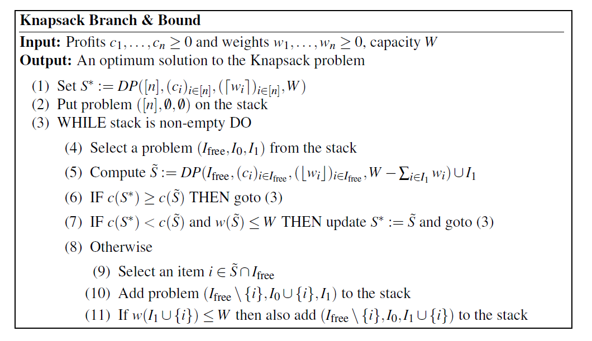

## Dynamic Programming Knapsack ##

### Inputs ###
* Weights are positive.
* profits are positive. 
* All single item has a weight that is less than the maximum weight allowed. 

### ALGO ###
* T[j, w] := the profits of items using sub array from 0 to j such that it sums up to weight of exactly w. 

* The recurrence relation: 
    * `T[j + 1, w] := max(T[j, w - weight[j]] + profits[j + 1], T[j, w])`
    * if `w - weight[j] < 0` then just ignore that case. 
    
* Base cases: 
    * `T[0, 0] := 0`
    * `T[0, w] := profit[0] if weight[0] == w else -inf`
    
* Optimization: 
    * only the previous column of T is used for each iteration, so that can be simplied by storing only previous column. 
    * We need to keep track of the solution too.

* Interpreting results: 
    * take max of `T[j, w]` for all possible w (sum of all weights)
### Duality ###
* The above algorithm is the primal formulation of the problem, and there is a dual formulation of the same probolem which can be solved with dynamic programming. 

### Approximation Algorithm ###

* Inputs: in addition to the DP algorithm a new parameter `epsilon` in (0, 1) is added. 

#### ALGO ####
* Scale all numbers in the weights constraint using the multiplier: `log(w_max)/w_max` where w_max is the item with the maximum weights. 
    * This limits the size of the maximum weight, to a multiple of the numbers of items. 
    * Scale the Maximum weight allowed by the same factor, keep the problem unchanged. 
    * Scaling to a multiple of n is purely for mathematical beauty. 

* Round up the weights for each items, this makes all the weights an over estimation, this will provide an lower bound on profits of the solution. Round down the weights will provide an upper bound for the solution. 

* Compute the solution based on the rounded... weights... 

## Branch and Bound and Lower/Upper Bound Bound Heuristics ##

* Tuple `(I_f, I_0, I_1)` where each item represents: 
    * `I_1`: The solution we are definitely keeping. 
    * `I_0`: ~~~ we are not keeping. 
    * `I_f`: items we are still deciding. 
* Initialize `S*` as a lower bound for the real solution.
* (5) `S_tilda`: This is the solution where items in `I_free` is approximated (upper bound), and items in `I_1` is computed exactly.
* (6) Current choice of I_free and I_1 has an upper bound lower than global optimal, reject all I_free. 
* (7) `S_tilda` improves upper bound and feasible, mark that as current optimal. 
* (8) branch and bound, by neglecting/considering any random element from the `I_free` set. 
### Run-time ###
* Exponential for Pathological Inputs. 

 